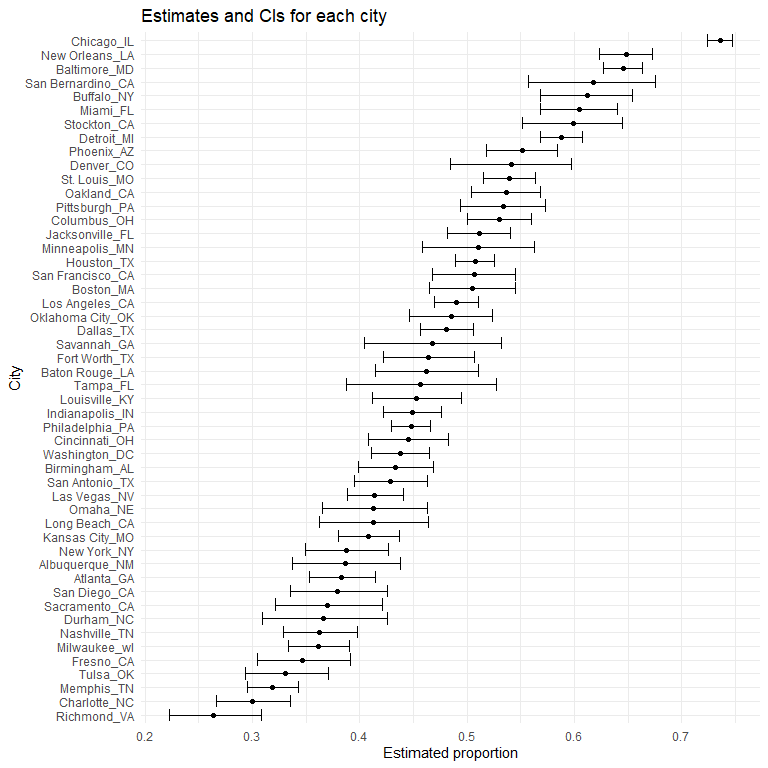
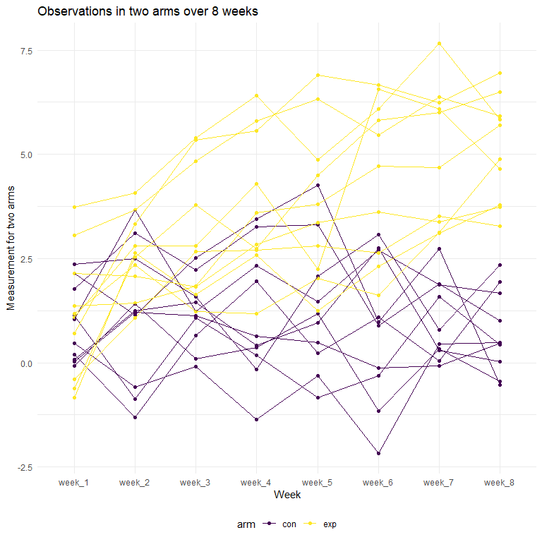
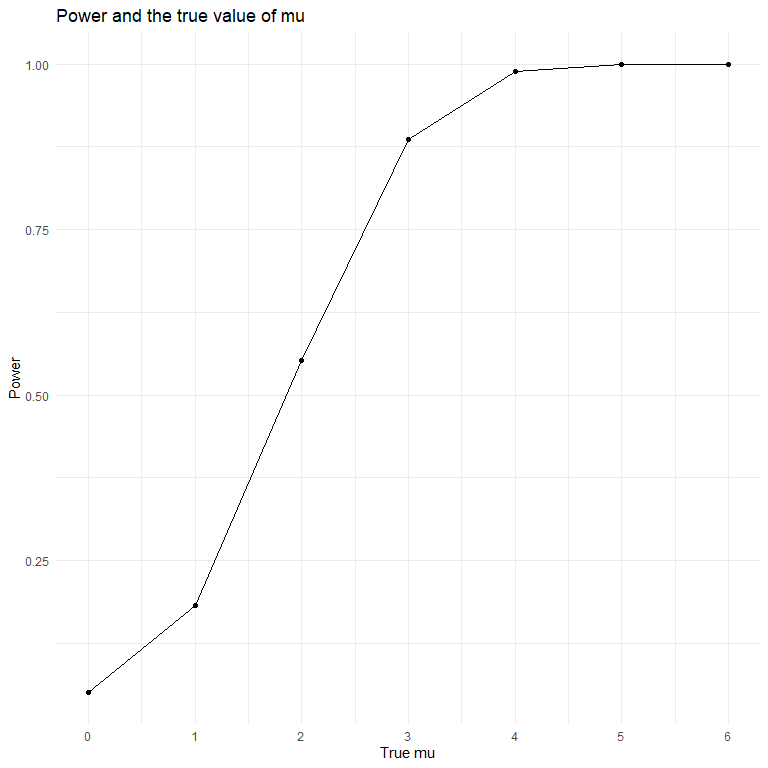

p8105\_hw5\_ys3394
================
Yifan Su
2020-11-17

## Problem 1

  - The raw data *Washington Post* gatghered data mapping more than
    52,000 homicides in major American cities over the past dacedes, and
    includes where murder is common but unsolved.

  - In the dataset, it has 52179 rows and 12 columns. Variables in the
    data include characteristics of victims such as race, age and sex.
    Also, there are variables specify murders, including city, state
    they occured, and the reported date.

#### Summarize number of homicides within cities

``` r
# Read in the data
homicide_df = 
  read_csv("homicide_data/homicide-data.csv") %>% 
  mutate(
    city_state = str_c(city, state, sep = "_"),
    resolved = case_when(
      disposition == "Closed without arrest" ~ "unsolved",
      disposition == "Open/No arrest"        ~ "unsolved",
      disposition == "Closed by arrest"      ~ "solved",
    )
  ) %>% 
  select(city_state, resolved) %>% 
  filter(city_state != "Tulsa_AL") %>% 
  group_by(city_state) %>% 
  summarize(
    hom_total = n(),
    hom_unsolved = sum(resolved == "unsolved")
  )
```

#### `prop.test` for city Baltimore

``` r
baltimore_test =
prop.test(
  homicide_df %>% filter(city_state == "Baltimore_MD") %>% pull(hom_unsolved), 
  homicide_df %>% filter(city_state == "Baltimore_MD") %>% pull(hom_total)) %>%
  broom::tidy() %>% 
  select(estimate, conf.low, conf.high)
```

#### `prop.test` for each of the cities

``` r
results_df = 
  homicide_df %>% 
  mutate(
    prop_tests = map2(.x = hom_unsolved, .y = hom_total, ~prop.test(x = .x, n = .y)),
    tidy_tests = map(.x = prop_tests, ~broom::tidy(.x))
  ) %>% 
  select(-prop_tests) %>% 
  unnest(tidy_tests) %>% 
  select(city_state, estimate, conf.low, conf.high)
```

#### A plot showing estimates and CIs for each city

``` r
results_df %>% 
  mutate(city_state = fct_reorder(city_state, estimate)) %>% 
  ggplot(aes(y = city_state, x = estimate)) +
  geom_point() + 
  geom_errorbar(aes(xmin = conf.low, xmax = conf.high)) +
  labs(x = "Estimated proportion",
       y = "City",
       title = "Estimates and CIs for each city")
```



## Problem 2

**A tidy dataframe containing data from all participants, including the
subject ID, arm, and observations over time.**

``` r
# Make a tidy dataframe combines all datasets
path_df = 
  tibble(
    path = list.files("lda_data"),
  ) %>% 
  mutate(
    path = str_c("lda_data/", path),
    data = map(.x = path, ~read_csv(.x)),
    arm_id = str_remove(path, "lda_data/"),
    arm_id = str_remove(arm_id, ".csv")) %>% 
  unnest(data) %>% 
  select(-path) %>% 
  pivot_longer(
    week_1:week_8,
    values_to = "arm_data",
    names_to = "week"
  ) %>% 
  separate(arm_id, into = c("arm", "id"), sep = "_")

head(path_df)
## # A tibble: 6 x 4
##   arm   id    week   arm_data
##   <chr> <chr> <chr>     <dbl>
## 1 con   01    week_1     0.2 
## 2 con   01    week_2    -1.31
## 3 con   01    week_3     0.66
## 4 con   01    week_4     1.96
## 5 con   01    week_5     0.23
## 6 con   01    week_6     1.09
```

  - In this step, I made `path_df` a tidy dataframe containging arms,
    subject ID and measurements.

**Make a spaghetti plot showing observations on each subject over time,
and comment on differences between groups.**

``` r
# Make a spaghetti plot 
plot_spaghetti =
  path_df %>% 
  unite("arm_id", arm:id, remove = FALSE) %>% 
  ggplot(aes(x = week, y = arm_data, group = arm_id, color = arm)) + # use group, or it recognize weeks as groups.
  geom_point() +
  geom_line() +
  labs(x = "Week",
       y = "Measurement for two arms",
       title = "Observations in two arms over 8 weeks")

plot_spaghetti
```



  - In this plot, the measurement of two arms at the beginning is not
    that different, but the measurements for observations in the
    experimental arm increased over time. Meanwhile, the trend in the
    control arm is that measurements remain the same, and even decreased
    slightly.

## Problem 3

### Generate 5000 datasets from the normality model, obtain the estimate and p-value.

**First set n = 30, sigma = 5, mu = 0, and run the t-test once.**

``` r
# Run t-test for one time 
n = 30
mu = 5
sigma = 5
x = rnorm(n, mean = mu, sd = sigma)
t.test(x, mu = mu, conf.level = 0.95)
## 
##  One Sample t-test
## 
## data:  x
## t = -0.8504, df = 29, p-value = 0.4021
## alternative hypothesis: true mean is not equal to 5
## 95 percent confidence interval:
##  2.419280 6.064888
## sample estimates:
## mean of x 
##  4.242084
```

**Write a function `sim_data`**

``` r
set.seed(100)
sim_ttest = function(mu) {
  
  sim_data = 
    tibble(
    x = rnorm(30, mean = mu, sd = 5)
  )
  
  sim_data %>% 
    summarize(
        t_test = t.test(x, mu = 0, conf.level = 0.95) %>% 
        broom::tidy() %>% 
        select(p.value, estimate)
    ) %>% 
    mutate(p_value = t_test$p.value,
           estimate = t_test$estimate) %>% 
    select(p_value, estimate)
}

# use mu = 0 to test if the function works
sim_ttest(0)
## # A tibble: 1 x 2
##   p_value estimate
##     <dbl>    <dbl>
## 1   0.823    0.144
```

**Repeat the above for μ={0,1,2,3,4,5,6}**

``` r
# repeat for mu = 0~6 5000 times
set.seed(1000)
sim_results = 
  tibble(mu = c(0, 1, 2, 3, 4, 5, 6)) %>% 
  mutate(
    output_lists = map(.x = mu, ~rerun(5000, sim_ttest(mu = .x))),# be very specific
    estimate_dfs = map(output_lists, bind_rows)) %>% 
  select(-output_lists) %>% 
  unnest(estimate_dfs)
```

**A plot showing the proportion of times the null was rejected (power)
versus the true value of mu**

``` r
# A plot showing the power
set.seed(1000)
plot_power = 
sim_results %>% 
  filter(p_value < 0.05) %>% 
  group_by(mu) %>% 
  summarize(prop_rej = n()) %>% 
  mutate(prop_rej = prop_rej/5000) %>% 
  ggplot(aes(x = mu, y = prop_rej), color = mu) +
  geom_point() +
  geom_line() +
  scale_x_continuous(limits = c(0,6), breaks = seq(0,6,1)) +
  labs(
    title = "Power and the true value of mu",
    x = "True mu",
    y = "Power"
  )

plot_power
```



  - The association between effect size and power:<br/> The power is the
    proportion of rejected times when the null is false. Since the null
    is always mu = 0 when the true value of mu = {1, 2, 3, 4, 5, 6}, the
    power increases as the effect size increases, and nearly reaches 1
    as true mu is 4.

### Make two plots showing relationships between estimated mu and true value of mu.

**A plot showing the average estimate of mu versus the true value of
mu**

``` r
# A plot showing the average estimate of mu
plot_mu_hat = 
  sim_results %>% 
  group_by(mu) %>% 
  summarize(estimate_mu = mean(estimate)) %>% 
  ggplot(aes(x = mu, y = estimate_mu), color = mu) +
  geom_point() +
  geom_line() +
  scale_x_continuous(limits = c(0,6), breaks = seq(0,6,1)) +
  labs(
    title = "Estimated mu and the true value of mu",
    x = "True mu",
    y = "Estimated mu"
  )
  
```

**A second plot of the average estimate of mu in samples for which the
null was rejected versus the true value of mu**

``` r
# A second plot of the average estimate of mu rejected
plot_rej_mu_hat = 
  sim_results %>% 
  filter(p_value < 0.05) %>% 
  group_by(mu) %>% 
  summarize(rej_estimate_mu = mean(estimate)) %>% 
  ggplot(aes(x = mu, y = rej_estimate_mu ), color = mu) +
  geom_point() +
  geom_abline() +
  scale_x_continuous(limits = c(0,6), breaks = seq(0,6,1)) +
  labs(
    title = "Estimated mu rejected and the true value of mu",
    x = "True mu",
    y = "Estimated mu rejected"
  )

# Combine two plots
plot_mu_hat / plot_rej_mu_hat
```


  - The sample average of mu among mu rejected is not approximately
    equal to the true value of mu when mu is 1 and 2, but the condition
    fits for mu equals to 3, 4, 5, and 6.

  - It is because that the proportion of rejected times (power)
    increases as mu increases when the truth that mu not equals to the
    null becomes obvious.
