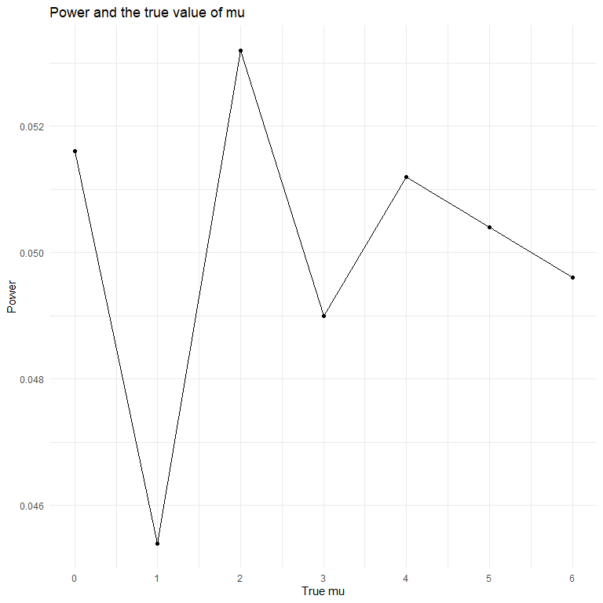
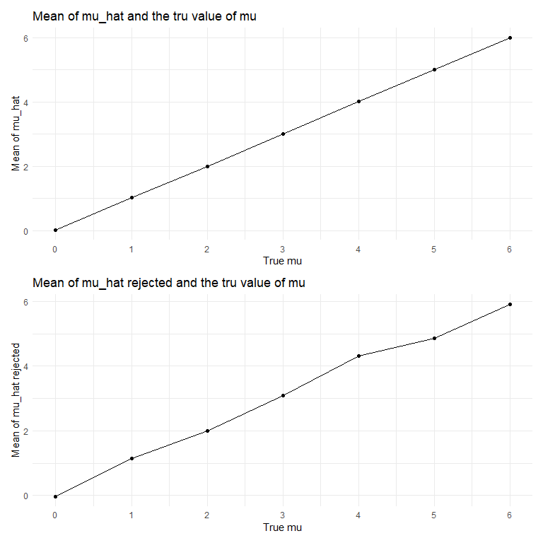

p8105\_hw5\_ys3394
================
Yifan Su
2020-11-14

## Problem 1

  - The raw data *Washington Post* gatghered data mapping more than
    52,000 homicides in major American cities over the past dacedes, and
    includes where murder is common but unsolved.

  - In the dataset, it has 52179 rows and 12 columns. Variables in the
    data include characteristics of victims such as race, age and sex.
    Also, there are variables specify murders, including city, state
    they occured, and the reported date.

#### Summarize number of homicides within cities

``` r
# Read in the data
homicide_df = 
  read_csv("homicide_data/homicide-data.csv") %>% 
  mutate(
    city_state = str_c(city, state, sep = "_"),
    resolved = case_when(
      disposition == "Closed without arrest" ~ "unsolved",
      disposition == "Open/No arrest"        ~ "unsolved",
      disposition == "Closed by arrest"      ~ "solved",
    )
  ) %>% 
  select(city_state, resolved) %>% 
  filter(city_state != "Tulsa_AL") %>% 
  group_by(city_state) %>% 
  summarize(
    hom_total = n(),
    hom_unsolved = sum(resolved == "unsolved")
  )
```

#### `prop.test` for city Baltimore

``` r
baltimore_test =
prop.test(
  homicide_df %>% filter(city_state == "Baltimore_MD") %>% pull(hom_unsolved), 
  homicide_df %>% filter(city_state == "Baltimore_MD") %>% pull(hom_total)) %>%
  broom::tidy() %>% 
  select(estimate, conf.low, conf.high)
```

#### `prop.test` for each of the cities

``` r
results_df = 
  homicide_df %>% 
  mutate(
    prop_tests = map2(.x = hom_unsolved, .y = hom_total, ~prop.test(x = .x, n = .y)),
    tidy_tests = map(.x = prop_tests, ~broom::tidy(.x))
  ) %>% 
  select(-prop_tests) %>% 
  unnest(tidy_tests) %>% 
  select(city_state, estimate, conf.low, conf.high)
```

#### A plot showing estimates and CIs for each city

``` r
results_df %>% 
  mutate(city_state = fct_reorder(city_state, estimate)) %>% 
  ggplot(aes(y = city_state, x = estimate)) +
  geom_point() + 
  geom_errorbar(aes(xmin = conf.low, xmax = conf.high)) +
  labs(x = "Estimated proportion",
       y = "City",
       title = "Estimates and CIs for each city")
```


## Problem 2 ideas …

import one dataset

``` r
path_df = 
  tibble(
    path = list.files("lda_data"),
  ) %>% 
  mutate(
    path = str_c("lda_data/", path),
    data = map(.x = path, ~read_csv(.x)),
    arm_id = str_remove(path, "lda_data/"),
    arm_id = str_remove(arm_id, ".csv")) %>% 
  unnest(data) %>% 
  select(-path) %>% 
  pivot_longer(
    week_1:week_8,
    values_to = "arm_data",
    names_to = "week"
  ) %>% 
  separate(arm_id, into = c("arm", "id"), sep = "_")
```

    ## Parsed with column specification:
    ## cols(
    ##   week_1 = col_double(),
    ##   week_2 = col_double(),
    ##   week_3 = col_double(),
    ##   week_4 = col_double(),
    ##   week_5 = col_double(),
    ##   week_6 = col_double(),
    ##   week_7 = col_double(),
    ##   week_8 = col_double()
    ## )
    ## Parsed with column specification:
    ## cols(
    ##   week_1 = col_double(),
    ##   week_2 = col_double(),
    ##   week_3 = col_double(),
    ##   week_4 = col_double(),
    ##   week_5 = col_double(),
    ##   week_6 = col_double(),
    ##   week_7 = col_double(),
    ##   week_8 = col_double()
    ## )
    ## Parsed with column specification:
    ## cols(
    ##   week_1 = col_double(),
    ##   week_2 = col_double(),
    ##   week_3 = col_double(),
    ##   week_4 = col_double(),
    ##   week_5 = col_double(),
    ##   week_6 = col_double(),
    ##   week_7 = col_double(),
    ##   week_8 = col_double()
    ## )
    ## Parsed with column specification:
    ## cols(
    ##   week_1 = col_double(),
    ##   week_2 = col_double(),
    ##   week_3 = col_double(),
    ##   week_4 = col_double(),
    ##   week_5 = col_double(),
    ##   week_6 = col_double(),
    ##   week_7 = col_double(),
    ##   week_8 = col_double()
    ## )
    ## Parsed with column specification:
    ## cols(
    ##   week_1 = col_double(),
    ##   week_2 = col_double(),
    ##   week_3 = col_double(),
    ##   week_4 = col_double(),
    ##   week_5 = col_double(),
    ##   week_6 = col_double(),
    ##   week_7 = col_double(),
    ##   week_8 = col_double()
    ## )
    ## Parsed with column specification:
    ## cols(
    ##   week_1 = col_double(),
    ##   week_2 = col_double(),
    ##   week_3 = col_double(),
    ##   week_4 = col_double(),
    ##   week_5 = col_double(),
    ##   week_6 = col_double(),
    ##   week_7 = col_double(),
    ##   week_8 = col_double()
    ## )
    ## Parsed with column specification:
    ## cols(
    ##   week_1 = col_double(),
    ##   week_2 = col_double(),
    ##   week_3 = col_double(),
    ##   week_4 = col_double(),
    ##   week_5 = col_double(),
    ##   week_6 = col_double(),
    ##   week_7 = col_double(),
    ##   week_8 = col_double()
    ## )
    ## Parsed with column specification:
    ## cols(
    ##   week_1 = col_double(),
    ##   week_2 = col_double(),
    ##   week_3 = col_double(),
    ##   week_4 = col_double(),
    ##   week_5 = col_double(),
    ##   week_6 = col_double(),
    ##   week_7 = col_double(),
    ##   week_8 = col_double()
    ## )
    ## Parsed with column specification:
    ## cols(
    ##   week_1 = col_double(),
    ##   week_2 = col_double(),
    ##   week_3 = col_double(),
    ##   week_4 = col_double(),
    ##   week_5 = col_double(),
    ##   week_6 = col_double(),
    ##   week_7 = col_double(),
    ##   week_8 = col_double()
    ## )
    ## Parsed with column specification:
    ## cols(
    ##   week_1 = col_double(),
    ##   week_2 = col_double(),
    ##   week_3 = col_double(),
    ##   week_4 = col_double(),
    ##   week_5 = col_double(),
    ##   week_6 = col_double(),
    ##   week_7 = col_double(),
    ##   week_8 = col_double()
    ## )
    ## Parsed with column specification:
    ## cols(
    ##   week_1 = col_double(),
    ##   week_2 = col_double(),
    ##   week_3 = col_double(),
    ##   week_4 = col_double(),
    ##   week_5 = col_double(),
    ##   week_6 = col_double(),
    ##   week_7 = col_double(),
    ##   week_8 = col_double()
    ## )
    ## Parsed with column specification:
    ## cols(
    ##   week_1 = col_double(),
    ##   week_2 = col_double(),
    ##   week_3 = col_double(),
    ##   week_4 = col_double(),
    ##   week_5 = col_double(),
    ##   week_6 = col_double(),
    ##   week_7 = col_double(),
    ##   week_8 = col_double()
    ## )
    ## Parsed with column specification:
    ## cols(
    ##   week_1 = col_double(),
    ##   week_2 = col_double(),
    ##   week_3 = col_double(),
    ##   week_4 = col_double(),
    ##   week_5 = col_double(),
    ##   week_6 = col_double(),
    ##   week_7 = col_double(),
    ##   week_8 = col_double()
    ## )
    ## Parsed with column specification:
    ## cols(
    ##   week_1 = col_double(),
    ##   week_2 = col_double(),
    ##   week_3 = col_double(),
    ##   week_4 = col_double(),
    ##   week_5 = col_double(),
    ##   week_6 = col_double(),
    ##   week_7 = col_double(),
    ##   week_8 = col_double()
    ## )
    ## Parsed with column specification:
    ## cols(
    ##   week_1 = col_double(),
    ##   week_2 = col_double(),
    ##   week_3 = col_double(),
    ##   week_4 = col_double(),
    ##   week_5 = col_double(),
    ##   week_6 = col_double(),
    ##   week_7 = col_double(),
    ##   week_8 = col_double()
    ## )
    ## Parsed with column specification:
    ## cols(
    ##   week_1 = col_double(),
    ##   week_2 = col_double(),
    ##   week_3 = col_double(),
    ##   week_4 = col_double(),
    ##   week_5 = col_double(),
    ##   week_6 = col_double(),
    ##   week_7 = col_double(),
    ##   week_8 = col_double()
    ## )
    ## Parsed with column specification:
    ## cols(
    ##   week_1 = col_double(),
    ##   week_2 = col_double(),
    ##   week_3 = col_double(),
    ##   week_4 = col_double(),
    ##   week_5 = col_double(),
    ##   week_6 = col_double(),
    ##   week_7 = col_double(),
    ##   week_8 = col_double()
    ## )
    ## Parsed with column specification:
    ## cols(
    ##   week_1 = col_double(),
    ##   week_2 = col_double(),
    ##   week_3 = col_double(),
    ##   week_4 = col_double(),
    ##   week_5 = col_double(),
    ##   week_6 = col_double(),
    ##   week_7 = col_double(),
    ##   week_8 = col_double()
    ## )
    ## Parsed with column specification:
    ## cols(
    ##   week_1 = col_double(),
    ##   week_2 = col_double(),
    ##   week_3 = col_double(),
    ##   week_4 = col_double(),
    ##   week_5 = col_double(),
    ##   week_6 = col_double(),
    ##   week_7 = col_double(),
    ##   week_8 = col_double()
    ## )
    ## Parsed with column specification:
    ## cols(
    ##   week_1 = col_double(),
    ##   week_2 = col_double(),
    ##   week_3 = col_double(),
    ##   week_4 = col_double(),
    ##   week_5 = col_double(),
    ##   week_6 = col_double(),
    ##   week_7 = col_double(),
    ##   week_8 = col_double()
    ## )

``` r
plot_spaghetti =
  path_df %>% 
  unite("arm_id", arm:id, remove = FALSE) %>% 
  ggplot(aes(x = week, y = arm_data, group = arm_id, color = arm)) +
  geom_point() +
  geom_line() +
  labs(x = "Week",
       y = "Measurement for two arms",
       title = "Observations in two arms over 8 weeks")
```

## Problem 3

``` r
n = 30
mu = 5
sigma = 5
x = rnorm(n, mean = mu, sd = sigma)
t.test(x, mu = mu, conf.level = 0.95)
```

    ## 
    ##  One Sample t-test
    ## 
    ## data:  x
    ## t = -0.8504, df = 29, p-value = 0.4021
    ## alternative hypothesis: true mean is not equal to 5
    ## 95 percent confidence interval:
    ##  2.419280 6.064888
    ## sample estimates:
    ## mean of x 
    ##  4.242084

``` r
sim_ttest = function(mu) {
  
  sim_data = 
    tibble(
    x = rnorm(30, mean = mu, sd = 5)
  )
  
  sim_data %>% 
    summarize(
      mu_hat = mean(x),
      t_test = t.test(x, mu = mu, conf.level = 0.95) %>% 
        broom::tidy() %>% 
        select(p.value)
    )
}

sim_ttest(0)
```

    ## # A tibble: 1 x 2
    ##   mu_hat t_test$p.value
    ##    <dbl>          <dbl>
    ## 1 -0.593          0.520

``` r
set.seed(1000)
sim_results = 
  tibble(mu = c(0, 1, 2, 3, 4, 5, 6)) %>% 
  mutate(
    output_lists = map(.x = mu, ~rerun(5000, sim_ttest(mu = .x))),# be very specific
    estimate_dfs = map(output_lists, bind_rows)) %>% 
  select(-output_lists) %>% 
  unnest(estimate_dfs) %>% 
  mutate(p_value = t_test$p.value) %>% 
  select(mu, mu_hat, p_value)
```

``` r
set.seed(1000)
plot_power = 
sim_results %>% 
  filter(p_value < 0.05) %>% 
  group_by(mu) %>% 
  summarize(prop_rej = n()) %>% 
  mutate(prop_rej = prop_rej/5000) %>% 
  ggplot(aes(x = mu, y = prop_rej), color = mu) +
  geom_point() +
  geom_line() +
  scale_x_continuous(limits = c(0,6), breaks = seq(0,6,1)) +
  labs(
    title = "Power and the true value of mu",
    x = "True mu",
    y = "Power"
  )
```

    ## `summarise()` ungrouping output (override with `.groups` argument)

``` r
plot_power
```



``` r
plot_mu_hat = 
  sim_results %>% 
  group_by(mu) %>% 
  summarize(mean_mu_hat = mean(mu_hat)) %>% 
  ggplot(aes(x = mu, y = mean_mu_hat), color = mu) +
  geom_point() +
  geom_line() +
  scale_x_continuous(limits = c(0,6), breaks = seq(0,6,1)) +
  labs(
    title = "Mean of mu_hat and the tru value of mu",
    x = "True mu",
    y = "Mean of mu_hat"
  )
```

    ## `summarise()` ungrouping output (override with `.groups` argument)

``` r
plot_rej_mu_hat = 
  sim_results %>% 
  filter(p_value < 0.05) %>% 
  group_by(mu) %>% 
  summarize(mean_rej_mu_hat = mean(mu_hat)) %>% 
  ggplot(aes(x = mu, y = mean_rej_mu_hat ), color = mu) +
  geom_point() +
  geom_path() +
  scale_x_continuous(limits = c(0,6), breaks = seq(0,6,1)) +
  labs(
    title = "Mean of mu_hat rejected and the tru value of mu",
    x = "True mu",
    y = "Mean of mu_hat rejected"
  )
```

    ## `summarise()` ungrouping output (override with `.groups` argument)

``` r
plot_mu_hat / plot_rej_mu_hat
```


